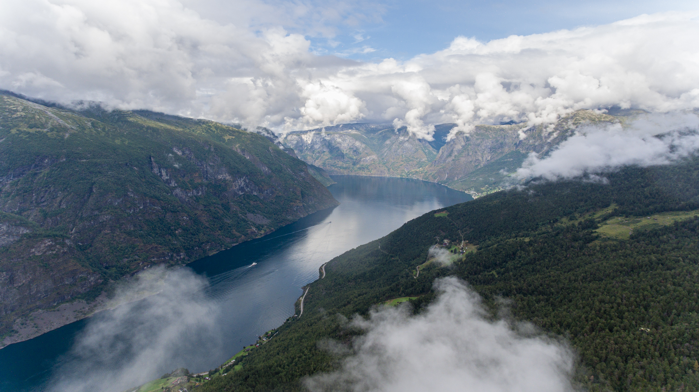
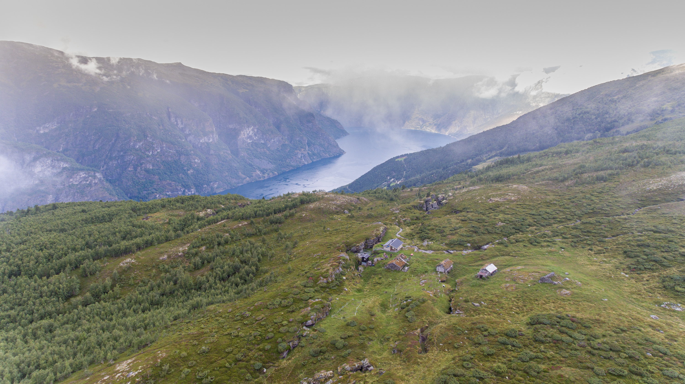
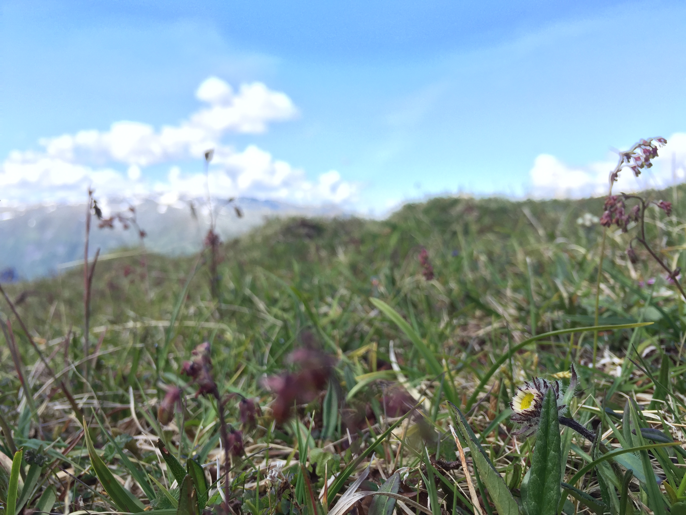
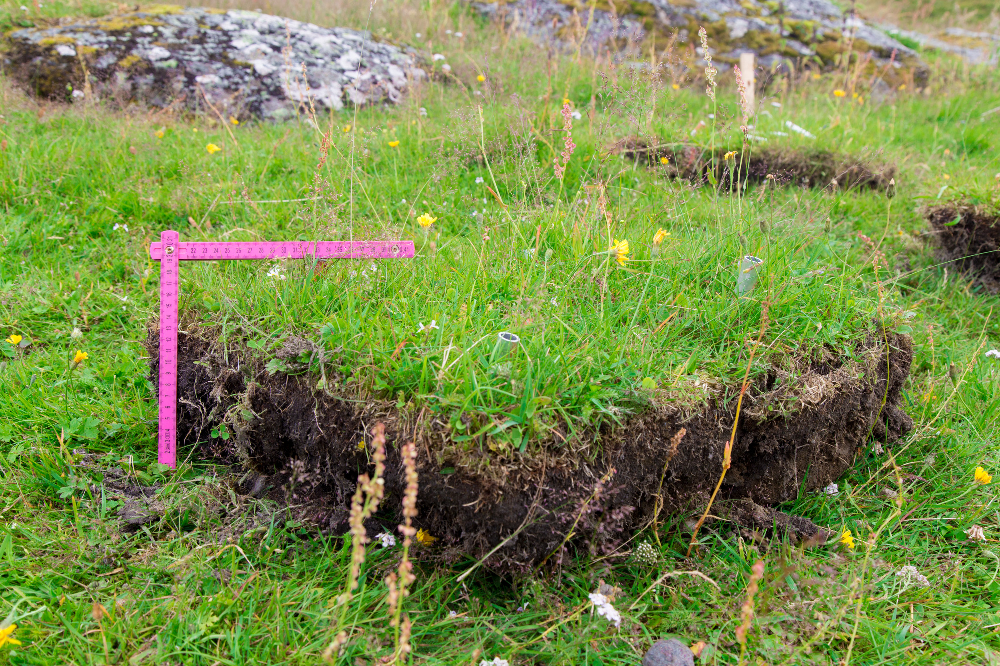
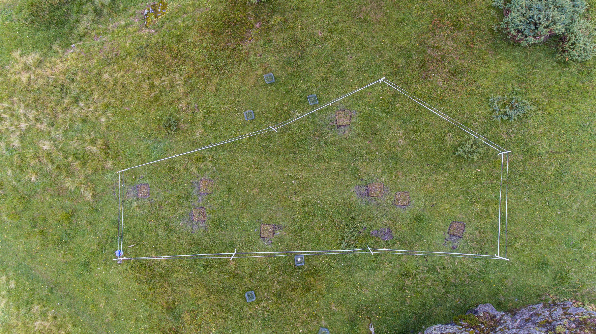

``` {r setup, include=FALSE}
knitr::opts_chunk$set(echo = FALSE)
```

# The study system

## Alpine ecosystems in Western Norway

The PFTC6 will be held in Aurland in the fjords of Western Norway.

```{r map-aurland, out.width='100%', fig.cap= "The fjords in Aurland in Western Norway."}


```

Typical alpine grasslands in this area look like this:

```{r grasslands, out.width="49%", out.height="20%", fig.show='hold',fig.align='center', fig.cap= "A typical alpine grasslands and one at lower elevation."}

knitr::include_graphics(c('images/sites/alpine_grassland.jpg', 'images/sites/alpine2.jpg'))
```


## Three-D project - Global change impacts on biodiversity and ecosystem carbon fluxes

For a complete description of the experiment see [here](https://github.com/audhalbritter/Three-D).

### Study sites

The study is conducted in three semi-natural grassland sites in western Norway.
The sites are location on calcareous soil (loamy sand).
The sites were chosen to fit within an elevational gradient with three temperature levels that differ in c. 400 m elevation, a temperature difference of approximately 3°C in summer temperature.
The sites correspond to boreal, sub-alpine and alpine biogeographic zones. 
Other factors such as history, bedrock, vegetation type and structure, slope and exposure were kept as constant as possible among the selected sites within each country. The sites are grazed by sheep and goats.

```{r exp-design, out.width='100%', fig.cap= "A) The experiment are set up along an elevational gradient that represents a productivity gradient. The experimental treatments are warming (brown), a grdient of nitrogen addition (grey to green) and their combination. These treatments are crossed with four grazing treatment: control (no clipping), intermediate and intensive clipping, and natural grazing outside the grazing exclosure. B) Example of a plot divided into non destructive (inner square) and and destructive sampling area (outer square)."}

knitr::include_graphics('images/sites/ExperimentalDesign.jpg')
```

The lowest site **Vikesland** is locate at 469 m a.s.l. (60.9°N,	7.2°E). 
It is located near a farm, with 200 goats. In summer, these goats are moving up and down the mountains each day, to graze at higher elevation and being milked at the farm in the valley.
The vegetation is dominated by _Agrostis capillaris_, _Anthoxantum odoratum_, _Achillea millefolium_, _Ranunculus acris_, and _Rumex acetosa_.


```{r vikeland, out.width='100%', fig.cap= "The lowest site at the farm Vikesland."}

knitr::include_graphics('images/sites/Vikesland.png')
```


The middle site **Joasete** is a summer farm and located at 920 m a.s.l.
The area around the summer farm is mostly grazed by sheep and sometimes goats.
The vegetation at Joasete is well adapted to the grazing pressure and nutrient input by the animals.
The dominant plant species are _Agrostis capillaris_, _Deschampsia cespitosa_, _Achillea millefolium_, _Ranunculus acris_, _Ranunculus repens_, and _Rumex acetosa_.

```{r joasete, out.width='100%', fig.cap= "The middle site at the summer farm Joasete"}


```


The highest site **Liahovden** is located at 1290 m a.s.l.
It is grazing moderately by sheep, deer and reindeer.
The vegetation is a species rich grassland, typical for nutrient soils in Norwegian alpine vegetation with _Achillea millefolium_, _Antennaria dioica_, _Bistorta vivipara_, _Leontodon autumnalis_, _Silene acaulis_, and _Thalictrum alpinum_.


```{r liadhovden, out.width='100%', fig.cap= "The higsest site at Liahovden."}


```


### Experimental treatments

At each site, ten blocks, with 8 plots were marked in each corner. Six plots were chosen relatively close to each other (inside the fence) and two plots were chosen further away (outside fence).
Each plot was given a unique originPlotID starting at the upper left corner in block 1 and the highest site. The numbering was continued to 160. After transplanting, each turf also received a unique destinationPlotID (a number from 1-200; see below).
Each plot received a combination of each treatment randomly (warming, nitrogen addition and grazing, see below). The randomization of the treatments was done in two steps. First, the 10 nitrogen levels were assigned randomly per block (i.e. block 1 received the same nitrogen level in each site). We chose to randomize the nitrogen treatment at the block level to avoid nitrogen contamination between the plots within the blocks.
Second, the warming and grazing treatments were randomized within block. The six plots within each block (inside the fence) were randomly assigned a warming and grazing treatment. The two plots per block located outside the fence, were randomly assigned a warming treatment.


**Warming treatment**

The warming treatment was conducted at the end of the growing season in 2019, by transplanting entire plant communities to lower elevation (c. +3°C).
The upslope left-hand corner of each turf was marked with a toothpick that the turfs could be placed in the similar position relative to the slope and block orientation at the destination site.
We used a knife to cut the turfs to 50 x 50 cm and to a depth of c. 10 - 25 cm, unless the soil was shallower, as was the case for some of the alpine plots.
After excavation, the turfs were packed into a cardboard box and transported to their respective target sites within one day. The control plots were not excavated or moved. 
We did not have local transplants, to control for the transplanting effect, because this was tested in a previous project and the transplanting did not affect species composition in Norway [@Vandvik2020-hu] or China [@Yang2018-uq].

```{r transplant, out.width='100%', fig.cap= "A turf that is being transplanted."}


```

The turfs were fitted into the gaps created by excavating turfs at the destination site, except for the low site, where gaps had to be made. Each block received one plot of each treatment.
Turfs were placed in the block with the same numerical value (1 - 10) and nitrogen level in the destination site as they originated from in the origin site.
Transplanted turfs were carefully planted into their destination plots (destinationPlotID) ensuring that the turf orientation was correct (using the toothpick marking the uphill left corner of each turf) and that the soil surface was in plane with the surrounding vegetation, and that the edges of the excavated plot was in good contact with the edges of the gap created when the original turf was excavated from the plot.
If necessary, loose soil was carefully removed from the underside of the turf, or local soil was added to the gap or around the edges to achieve this.

```{r transplant2, out.width='100%', fig.cap= "Turfs that have been transplanted from Liahovden to lower elevation at Joasete."}


```


**Nitrogen addition**

In each plot we added slow dissolving fertilizer as pellets (YaraBela OPTI-NS 27-0-0 (4S)).
We used oxidised nitrogen (NO and N~2~O) formed mainly by combustion processes, which are the main sources of atmospheric nitrogen deposition in remote regions (i.e., away from intensive agriculture and other sources or reduced nitrogen).
The fertilizer was added once at the start and once in the middle of the growing season from 2020 - 2021 (2022). 
Each block received one of the seven nitrogen levels: 0, 0.5, 1, 5, 10, 50, 100, 150 kg N ha^−1^ yr^−1^.
Three of the blocks were controls and received 0 kg N ha^−1^ yr^−1^.

The natural nitrogen deposition in Norway is 1.5-3.5 kg N ha^−1^ yr^−1^.
The critical load for changing species composition in these alpine grasslands is approximately 5-10 kg N ha^−1^ yr^−1^ in Norway.
We therefore wanted to have a range of nitrogen levels that were below and well above this critical load.


**Grazing treatment**

The warming and nitrogen treatments were crossed with four grazing treatments.
Grazing was simulated by clipping the vegetation manually with scissors 2-3 cm above the ground.
The four grazing treatments were natural grazing (N; outside the fence), medium level of grazing (M; 2x clipp), intensive level of grazing (I; 4x clipp), and untreated control plots (C).
The intermediate clipping level reflects the natural grazing level outside the exclosure and should control for differences between grazing and clipping (i.e. clipping is not selective and will not add faeces and urine).
The medium and intensive plots were clipped 2 or 4 times during the growing season.
The clipping treatment was conducted in 2020 - 2022.

```{r clipping, out.width='50%', fig.cap= "A plot that has been clipped and the biomass sorted to functional groups."}

knitr::include_graphics('images/sites/clipping.jpg')
```


## INCLINE project - Climate change and novel interactions


