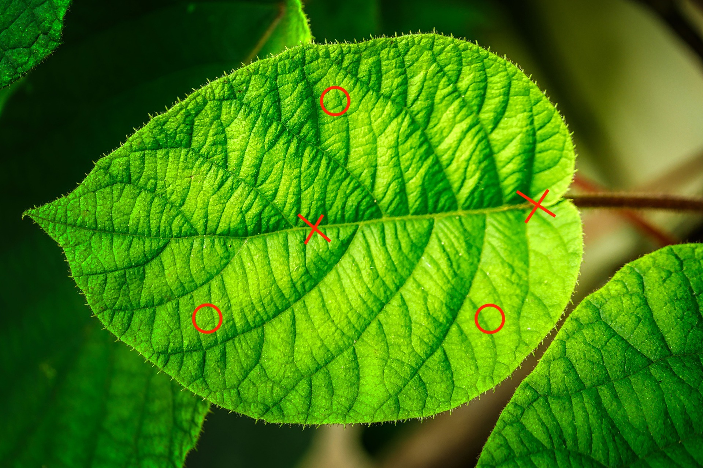

``` {r setup, include=FALSE}
knitr::opts_chunk$set(echo = FALSE)
```


## How to measure plant functional traits?

This protocol shows how to measure leaf functional traits in the trait wheel^TW^ during the PFTC courses.
The protocol is based on the trait handbook from Perez-Harguindeguy et al. [-@Perez-Harguindeguy2013-nv].


```{r trait-wheel, out.width='100%', fig.cap="The different stages from collection, processing and curating data from the trait wheel."}

knitr::include_graphics("images/trait_wheel/TraitWheel_small.png")

```


```{r collect, out.width='10%'}

knitr::include_graphics("images/trait_wheel/Collect.png")

```


**A Sampling individual plants in the field**

Be careful at all time when working in the experiment and avoid stepping on the experimental plots.
Make yourself familiar with the experimental design (check the site maps), and how plot, blocks and sites are marked.

To collect plants, go to your plot and use a sitting mat to sit next to the plot.
Collect the leaves and minimize disturbing the surroundings as much as possible.


**Intraspecific group**

_NOT FINAL PROTOCOL_

Follow the species list for our group, starting with the highest priority species for each site.
DO NOT collect plants from within the plots or the trampled zone around the plots.
Find 10 individuals of each species, ideally each individual should have five leaves, but three leaves is a minimum. 
Each individual should be at least two meters away from each other, to avoid sampling individuals from the same genetic individual. 
Choose reproductively mature adults with fully expanded leaves (i.e. not seedlings). 
Choose individuals with healthy-looking leaves (i.e. not grazed, no signs of pathogen or herbivore attack, no discoloration).
Before uprooting the individual, measure its height (see below). 
For very large individuals that are too large to uproot (e.g. ferns), collect 5 leaves from the individual, making sure to include the petiole.
If you are uncertain whether something is a leaf vs. leaflet, ask your group leader.
If you cannot find 10 individuals of each species, that is ok. 
After a reasonable search, move on.


**Global change group**

Each plot is 50 x 50 cm large and has an inner and outer part (see Figure \@ref(fig:plot)).
The plots are marked with metal tubes in each corner and a label on the top. 
The leaves should be collected from the outer part (destructive part) and if possible the inner part should stay untouched.

```{r plot, out.width='100%', fig.cap="Experimental design (left) and organization of the plot (right)."}

knitr::include_graphics("images/sites/ExperimentalDesign.jpg")

```

We aim to collect leaves from the species that make up 80% of the cover in each plot.
For each plot we will generate a species list.
Below is some code to generate this species list:


```{r cumsum, eval=FALSE, echo=TRUE}

threshold <-  80

cover |> 
  select(turfID, species, cover) |> 
  group_by(turfID) |> 
  arrange(turfID, -cover) |> 
  mutate(cumsum = cumsum(cover)) |> 
  filter(cumsum <= threshold)

```


For each plot and species find 5 individuals that are spread across the plot to avoid sampling clones.
Choose reproductively mature adults with fully expanded leaves (i.e. not seedlings) and healthy-looking leaves (i.e. not grazed, no signs of pathogen or herbivore attack, no discoloration).
_What do we do with grazed/clipped leaves in the grazing treatments?_

Measure the height of each individual and note down the height on the zip-loc bag (see below). 

Collect 1 leaf from the individual, making sure to include the petiole see Figure \@ref(fig:petiol).
If you are uncertain whether something is a leaf vs. leaflet, ask your group leader.

If you cannot find 5 individuals of each species, that is ok. 
After a reasonable search, move on to the next species or plot.

```{r petiol, out.width="49%", out.height="20%", fig.show='hold',fig.align='center', fig.cap="Leaf anatomy"}

knitr::include_graphics(c("images/trait_wheel/leaf_anatomy_1.png", "images/trait_wheel/leaf_anatomy_2.png"))

```


**Measuring vegetative height of individual plants in the field:**

Measure the vegetative height of the individual plant (see Figure \@ref(fig:height).
Vegetative height is the shortest distance between the main photosynthetic tissue on the plant and the ground, excluding any reproductive structure (e.g. buds, flowers or fruits). 
Leave the plant in it's natural form and do not stretch the plant if it bends.


```{r height, out.width="49%", out.height="20%", fig.show='hold',fig.align='center', fig.cap="Illustrations for how to measure vegetative height."}

knitr::include_graphics(c("images/trait_wheel/height_1.png", "images/trait_wheel/height_2.png"))

```

Record this measurement legibly (see Figure \@ref(fig:numbers) for how to write numbers) on the zip-loc bag.
Place the leaf/leaves for each individual in a bag with wet paper towels for transfer to lab.


```{r numbers, out.width='100%', fig.cap="The one and only approved way to write numbers! "}

knitr::include_graphics("images/trait_wheel/numbers.png")

```


```{r process, out.width='20%'}

knitr::include_graphics("images/trait_wheel/Process.png")

```

**Preparing leaves for measuring traits in lab:**

Select one (for the global change group) or five (for the intraspecific group) leaf/leaves per individual.
For analysing chemical traits such as percent P, C, N and isotopes, a certain amount of dry biomass is needed. 
Make sure that we are collecting 0.03 g  (30 mg) dried leaf material. 
Otherwise select several leaves until there is enough dry weight (bulk sample).

Add special rules for Norwegian leaves.

When collecting the leaf, include petiole and rachis (see Figure \@ref(fig:petiol)).
Pat the leaf dry with a tissue if there is visible water on the surface.
Add a barcode and a sticker to the envelope. 
Attach the sticker with a stapler.
Fill in all information between ‘collection day’ and ‘Bulk nr/length’, see Figure \@ref(fig:label) below. 
Check table below for options for the information.
Place the leaf inside the envelope
Put the envelope in a box for the next step. 
Make sure the envelopes are kept wet at all times.


```{r label, out.width="49%", out.height="20%", fig.show='hold',fig.align='center', fig.cap="Sticker and barcode example"}

knitr::include_graphics(c("images/trait_wheel/label.png", "images/trait_wheel/barcode.gif"))


```


_What to write on the envelope_

| Variable  | What to fill in  | |
|:---|:---|:---|
|  | Three-D | INCLINE |
| Collection day  | add day, e.g. 24  | add day, e.g. 24 |
| Site  | Vik, Joa, Lia | Ulv, Lav, Gud, Skj |
| Elevation  | 469, 920, 1290 | x, x, x, x |
| Genus  | Bistorta | |
| Species | vivipara | |
| Project | Trait = 3D, Sean = group 3, Drone = group 5 | Trait = I |
| Experiment | ambient/warm, N1-10, C/M/I/N | control or OTC |
| PlotID | turfID, e.g. 2 W5M 125 | ??? |
| Individual/leaf nr.  | 1-5  | 1-10/1-5 |


```{r wet, out.width='15%'}

knitr::include_graphics("images/trait_wheel/Wet.png")

```

**Wet mass**

Make sure the envelopes are still kept wet.
Weigh each leaf and write the weight on the envelope, including all digits.


```{r scan, out.width='15%'}

knitr::include_graphics("images/trait_wheel/Scan.png")

```

**Measure leaf area using a scanner**

_Start setup_

Connect your Laptop to the Raspberry PI.
Connect the PI with an ethernet cable to your laptop.
Connect the scanner to the PI.
Connect the barcode scanner to the PI.
Connect the power cable to the PI.

Wait for one minute.

Open VNC Viewer and type in the IP address corresponding to your PI:

| PI  | IP address |
|:---|:---|
| obi wan | 169.254.109.180 |
| yoda | 169.254.160.193 |
| bb-8 | 169.254.54.188 |
| c-3po | 169.254.247.22 |
| darth vader | 169.254.178.187 |
| r2-d2 | 169.254.231.2 |
| deathstar | 169.254.152.80 |
| mr. spock | 169.254.204.207 |
|  |  |
| connect with phone | 192.168.42.42 |

The spare SD card has the same IP address as the pi it is in! (???)


You will be asked to type in a username and password:

Username: pi

Password: pftc

Resize the screen for convenience.


_Scan leaves_

Make sure the envelopes are still kept wet.
Check that the scanner is clean and free of debris.
Clean if needed.
Place wet leaf face-down on the scanner.
Make sure the leaf is not folded and that leaflets do not overlap. 
The leaf should not go all the way to the edge of the scanner, because each picture will be cropped.
You can cut the leaf into several pieces if needed, but please make a remark if you do so (e.g. cut 3). 
You can tape the leaf to the scanner using transparent tape if it folds (e.g. grasses).

For **graminoids** (grasses, sedges, rushes):
Spread graminoid blades flat and tape to scanner if necessary to hold them in place.

**Exceptions**
*Festuca* species are naturally folded and should not be unfolded.


Exclude the leaf sheath (see Figure \@ref(fig:leaf)).

```{r leaf, out.width='40%', fig.cap="Leaf blade and sheats"}

knitr::include_graphics("images/trait_wheel/leaf.jpeg")

```


_Scan, save and check the leaf_

Click on the leaf icon (only needs to be done the first time).
This will start the scanning program.
If the scanner cannot be found, wait for a bit and try again.
Check the settings of the scanner.
These should be set as standard, so please do not touch them if not needed.

The scanner settings should be:

- saved in Desktop/leaf_scans/
- Type: JPEG
- Colour
- Full colour range
- 300dpi

From here, do this for each leaf:

Press scan (at the bottom of the window) and wait a couple of seconds until the scanning process is done.
A new window will pop up.
Adjust the zoom to see the full picture (about 25%).
Check the quality of the scan (has the whole leaf been scanned, is the leaf not upside down, dirt on the scan, etc.). 
If the scan is not ok, adjust the leaf and repeat the scan.

When the scan is ok, click on the green save button to save the scan. 
Make sure the cursor marks the filename (should be default). 
Scan the barcode on the envelope of the leaf that has been scanned with the barcode reader.
The filename should be something like: AAA4667 (3 letters and 4 digits).
When the scan is saved, the PI will check that the LeafID and that the scanning settings (dpi, etc.) are correct. 
If anything is wrong, it will open a window with an error message see Figure \@ref(fig:error). 
Please read it!


```{r error, out.width='50%', fig.cap="Error message."}

knitr::include_graphics("images/trait_wheel/error.png")

```

Click anywhere in the window and it will disappear.
Save the scan with the correct name or scan the leaf again if the settings are wrong.
MAKE SURE TO DELETE THE SCAN WITH THE WRONG NAME OR SETTING.
Tick the box on the envelope that the leaf has been scanned.
Make sure the scanned leaves are kept wet and move them to the next station.

From time to time:

When you are finished with scanning click on the yoda icon. 
This will check the leafIDs.
If anything is wrong it will open a window and indicate which scans are wrong.
Make sure to fix all the wrong leafIDs and not to have duplicate scans before leaving the station.

Before leaving the station:

Copy all the scans onto a stick and deposit them on the PFTC6 hard drive.
Shut down the pi.
Wait 1 min to disconnect it from the power.


```{r thick, out.width='18%'}

knitr::include_graphics("images/trait_wheel/Thickness.png")

```

**Leaf thickness**

Make sure the envelopes are still kept wet.
Thickness varies over the surface of the leaf; generally, the leaf is thickest at the midrib, primary veins, margins, and leaf base. 
Avoid the midrib when measuring leaf thickness, unless the leaf is too small. 
Take three thickness measurements at several points on the lamina and note them on the envelope.
From this, we will later calculate the average thickness. 
If the leaf is small, it may not be possible to take three unique measurements.

```{r vein, out.width='40%'}



```

**Ferns** Make sure you do not measure thickness on the spore-producing sori on the lower side of fern frond.


```{r entry, out.width='15%'}

knitr::include_graphics("images/trait_wheel/Data.png")

```

**Data entry**

Ideally the envelope should still be kept wet until this point in case any information is missing.
Go to this [google sheet](https://docs.google.com/spreadsheets/d/1ncqbniu0NUzCfcNe2fOl6M2Yj-BeOEXcYlPZHwNiIbk/edit?usp=sharing).
Connect a barcode scanner to your computer.
Scan the barcode of an envelope. 
Make sure that your cursor is in the right cell (ID).
Enter all the data that is on the envelope (for details see table below).
If any of the information is missing, check if it has been forgotten. 
Has the leaf been scanned, one thickness measurement is missing, etc. 
If anything is missing bring the leaf back to the according station in the trait wheel.
When finished, check the box on the envelope that the data has been entered.
Take a picture of the envelope.
Bring the envelop to the drying station.


_What to write on the envelope_

| Variable  | What to fill in  | |
|:---|:---|
|  | Three-D | INCLINE |
| Collection day  | add day, e.g. 24  | add day, e.g. 24 |
| Site  | Vik, Joa, Lia | Ulv, Lav, Gud, Skj |
| Elevation  | 469, 920, 1290 | x, x, x, x |
| Genus  | Bistorta | |
| Species | vivipara | |
| Project | Trait = group 1 + 2, Sean = group 3, Drone = group 5 | |
| Experiment | ambient, warm, N level, grazing | control or warm |
| PlotID | turfID, e.g. 2 W5M 125 | ??? |
| Individual Nr  | numeric value  | numeric value |


```{r dry, out.width='10%'}

knitr::include_graphics("images/trait_wheel/Dry.png")

```

**Dry mass**
 
The leaves will be dried in the oven for 72 hours.


```{r check, out.width='15%'}

knitr::include_graphics("images/trait_wheel/Check.png")

```

**Data checking**

_Check scans_
Find the folder with the leave scans on google drive: link
Open each scan and check the follwing criterias:

- Is the whole leaf on the scan?
- Has nothing else been scanned (cable, paper,...)?
- Is there dirty the scan?
- Has the leaf been cut? If yes, is it indicated on the envelope?
- How many leaves are on the scan? If > 1 is there a remark on the envelope?

_Check data_
Open RStudio project and the R script (...).
Download the trait data from google sheet.
Check if the leafID is valid.
Check if the variables have valid entries. E.g. correct day, site name, elevations, etc.
Check if missing values can be found on the envelope or retrieved from the data.
Plot the data to check if traits have unrealistic values.
For more details see section data curation.


```{r datadoc, out.width='8%'}

knitr::include_graphics("images/trait_wheel/DataDoc.png")

```

**Data documentation**

Describing method
Describing data
...


