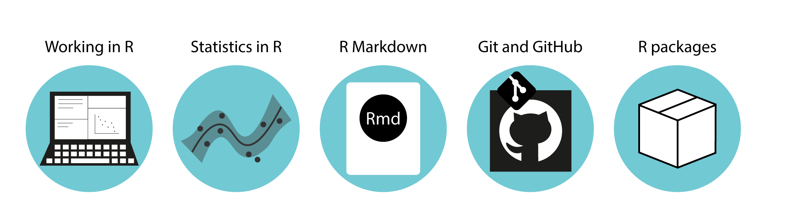

``` {r setup, include=FALSE}
knitr::opts_chunk$set(echo = FALSE)
```

## Data handling and analysis

```{r icons, out.width='100%'}

```

Getting started with R, working in R and ...

[Biostats books](https://biostats-r.github.io/biostats/index.html)

