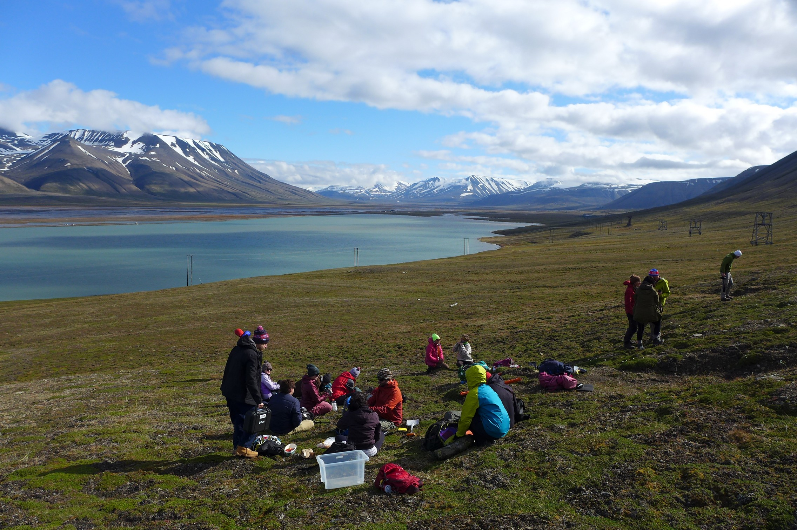

```{r, echo=FALSE}
knitr::opts_chunk$set(echo = FALSE)
#, warning = FALSE, error = TRUE
```


# PFTC Teaching material {-}

This book provides the teaching material for the Plant Functional Trait Courses (PFTC).

The PFTC courses are an international course with hands-on training in trait-based ecology.
Here we provide teaching material for data collection, curation, analysis, documentation, storage, and reuse.
In addition, we show reproducible and transparent workflows to make research more open and available.
We cover these topics within the fields of plant functional trait ecology, ecosystem ecology, plant physiology and remote sensing.


```{r field, out.width='100%'}



```
